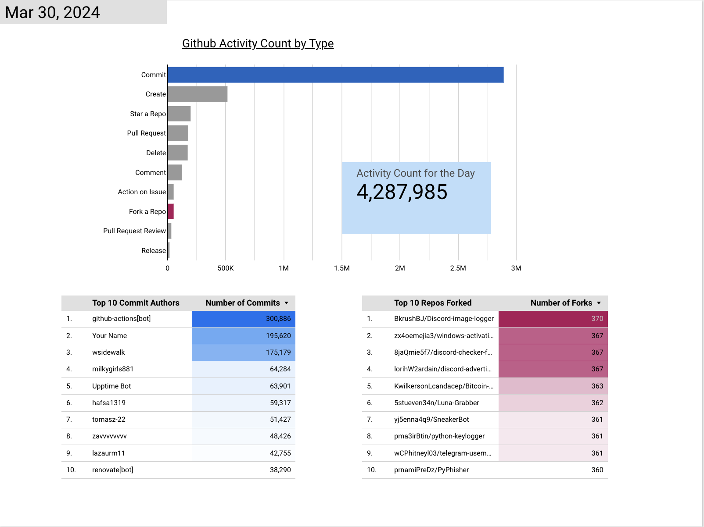
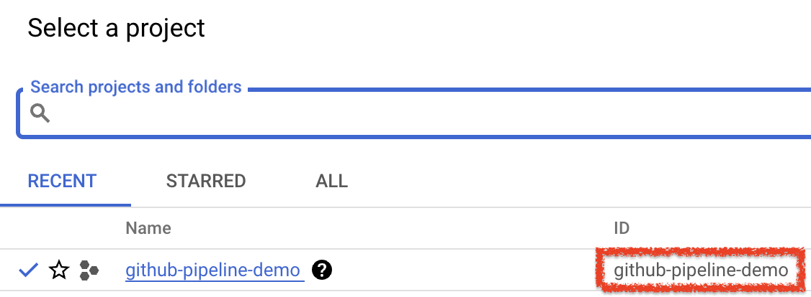
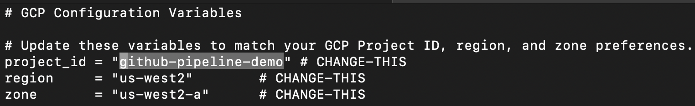
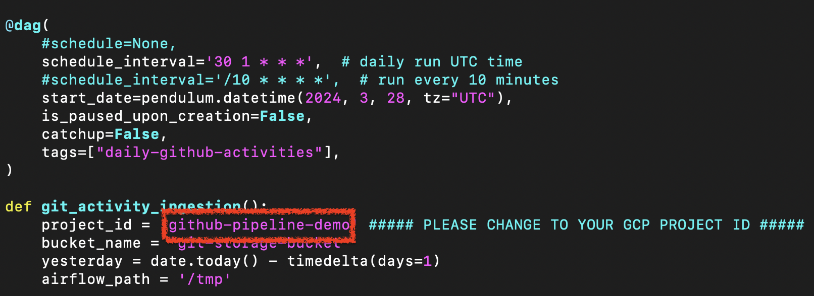
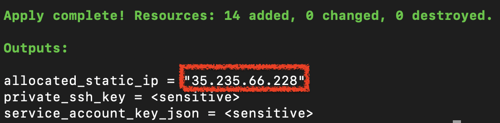
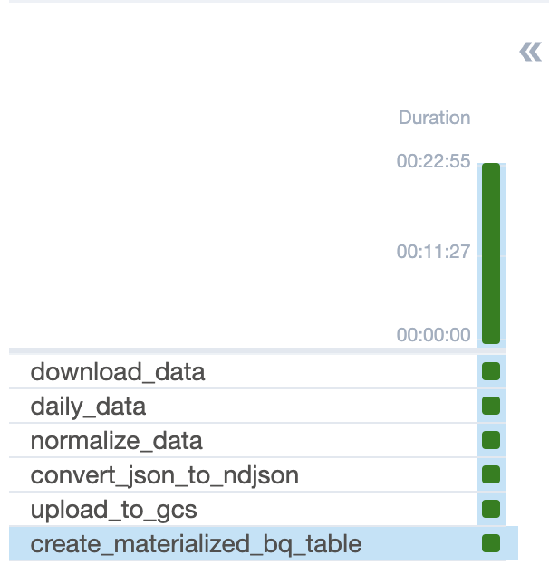
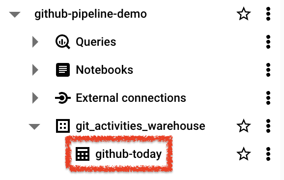

# GitHub Daily Activities Dashboard

---

Github is the world's largest source code host. It is commonly used to host open-source software development projects. GitHub has reported having over 100 million developers and more than 420 million repositories, of which at least 28 million are public.

GitHub, being the most popular platform for creating, storing, managing, and sharing code, serves as the focal point of this dashboard, which aims to illustrate how developers worldwide use GitHub. Our dashboard tracks the daily total count of public activities, identifies the top 10 users who authored the most commits, and lists the 10 most popular repositories that were forked each day.

Below is a screenshot of the dashboard:

---

## Data Pipeline Description

Our dashboard is updated daily through a batch data pipeline, scheduled to automatically run each day by executing the following steps:

1. Source data is obtained via an API call. It is then parsed, cleaned, and transferred to our selected data lake, Google Cloud Storage.
2. Once all the data is in the data lake, an external table is created within the data warehouse, BigQuery.
3. Scheduled dbt (data build tool) jobs transform the data into formats optimized for dashboard use.
4. The dashboard's visualizations are frequently refreshed to display the most current data.

## Technologies

- Cloud Platform: Google Cloud Platform (GCP)
- Infrastructure as Code (IaC): Terraform
- Workflow Orchestration: Airflow, 6 steps in the DAG
- Data Warehouse: BigQuery, data clustered by activity type
- Batch Transformation: dbt (data build tool)
- Visualization: Google Looker Studio
- Programming Languages: Python, Bash Scripting

---
## Reproduction

### Prerequisites: 
You have installed and set up the following tool - 
- Docker
- Terraform
- GCP account
- dbt cloud account

### Step 1 - Create a new GCP project

- Once your project is created, keep a note of your project id
&nbsp;&nbsp;&nbsp;

### Step 2 - Set up the pipeline using Terraform 
    
1. change your project id, regions in terraform.tfvars
&nbsp;&nbsp;&nbsp;
   
2. change your username and passwork for logging into Airflow web UI in flow/.env

3. change your project id in /flow/dags/ingestion.py
&nbsp;&nbsp;&nbsp;
    
4. in the terminal, navigate into the terraform folder and run the following commands
$ terraform init
$ terraform plan
$ terraform apply

### Step 3 - Monitor the pipeline job
    
1. Once the terraform set-up completes, the output in the terminal will have your virtual machine's external ip. You will need it for the Airflow web UI.  

&nbsp;&nbsp;&nbsp;
    
2. Wait a few minutes for the Airflow docker to bring up the web UI. Then access the UI through http://vm_external_ip:8080/
3. Once all 6 DAG tasks finish running, data files should be in google cloud storage and a clustered table should have been created in BigQuery. Partition is not used because it doesn't fit our use case for this pipeline.
&nbsp;&nbsp;&nbsp;
4. Confirm that data files are in gcs bucket and data table exists in BigQuery.

&nbsp;&nbsp;&nbsp;

### Step 4 - Transformation in dbt
    
1. the repo for dbt is [here](https://github.com/yh2527/dbt-github-daily-activities)
2. Please refer to the dbt instruction [here](https://docs.google.com/document/d/1y0DqZH9GWhRzLZW4bXWBNjSL7Z85UJ_zRSD654t6Kzg/edit?usp=sharing)

### Step 5 - Dashboard
- Sample dashboard can be found [here](https://lookerstudio.google.com/s/hu76D8e84kU)

---
Thank you! If you have any question or any trouble reproducing this pipeline, please message me in the class Slack channel @Cookie Monster 
