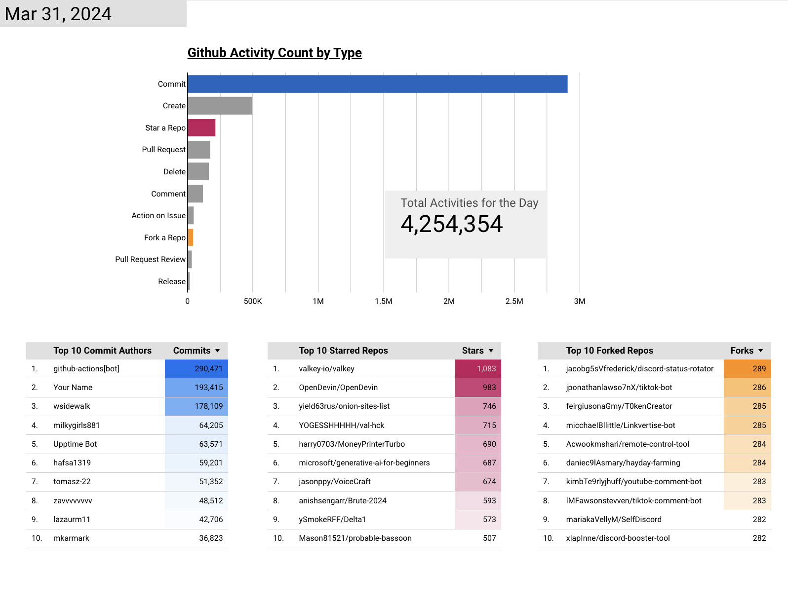

# GitHub Daily Activities Dashboard

---

Github is the world's largest source code host. It is commonly used to host open-source software development projects. GitHub has reported having over 100 million developers and more than 420 million repositories, of which at least 28 million are public.

GitHub, being the most popular platform for creating, storing, managing, and sharing code, serves as the focal point of this dashboard, which aims to illustrate how developers worldwide use GitHub. Our dashboard tracks the daily total count of public activities, identifies the top 10 users who authored the most commits, and lists the 10 most popular repositories that were starred or forked each day.

Below is a screenshot of the dashboard. The actual dashboard can be found [here](https://lookerstudio.google.com/s/v0H8vyycrZc).

---

## Data Pipeline Description

Our dashboard is updated daily through a batch data pipeline, scheduled to automatically run each day by executing the following steps:

1. Infrastructure, including a Google Cloud Storage bucket, a BigQuery dataset, and a virtual machine in the cloud, is set up by Terraform scripts. The pipeline is transferred to the virtual machine as part of the Terraform configuration.
2. Within the pipeline, source data is obtained through an API call. It is then parsed, cleaned, and transferred to our selected data lake, Google Cloud Storage, utilizing Python.
3. Once all the data is in the data lake, a clustered table is created in the data warehouse, BigQuery.
4. Scheduled dbt (data build tool) jobs transform the data into formats optimized for dashboard use.
5. The dashboard's visualizations are frequently refreshed to display the most current data.

## Technologies

- Cloud Platform: Google Cloud Platform (GCP)
- Infrastructure as Code (IaC): Terraform
- Workflow Orchestration: Airflow with 6 steps in the DAG
- Data Warehouse: BigQuery, table clustered by activity type
- Batch Transformation: dbt (data build tool)
- Visualization: Google Looker Studio
- Programming Languages: Python, SQL, Bash Scripting

---
## How To

### Prerequisites: 
It is assumed that you have installed, set up, and have access to the following tools and accounts - 
- Docker
- Terraform
- A Google Cloud Platform (GCP) account
- A dbt cloud account

### Step 1 - Create a new GCP project

- Once your project is created, keep a note of your project id.

&nbsp;&nbsp;&nbsp;&nbsp;&nbsp;&nbsp;&nbsp;

### Step 2 - Set up the pipeline using Terraform 
    
1. Change your project id, regions in terraform.tfvars

&nbsp;&nbsp;&nbsp;&nbsp;&nbsp;&nbsp;&nbsp;
   
2. Change your username and password in ingestion/.env for logging into the Airflow web UI.

3. Change your project id in ingestion/dags/ingestion.py

&nbsp;&nbsp;&nbsp;&nbsp;&nbsp;&nbsp;&nbsp;
    
4. In the terminal, navigate into the terraform folder and run the following commands - 
- $ terraform init
- $ terraform plan
- $ terraform apply

### Step 3 - Monitor the pipeline job
    
1. Once the terraform set-up completes, the output in the terminal will display your virtual machine's external IP. You will need it to access to the Airflow web UI.  

&nbsp;&nbsp;&nbsp;&nbsp;&nbsp;&nbsp;&nbsp;
    
2. Wait a few minutes for the Airflow docker to bring up the web UI. Then open the UI through http://(change to your vm IP)35.235.66.228:8080/ using the username and password you previously set in the ingestion/.env file.
3. Once all 6 DAG tasks finish running, data files should be in google cloud storage and a clustered table should have been created in BigQuery. Partition is not used because it doesn't fit our use case for this data pipeline.

&nbsp;&nbsp;&nbsp;&nbsp;&nbsp;&nbsp;&nbsp;

4. Confirm that data files are in gcs bucket and data table exists in BigQuery.

&nbsp;&nbsp;&nbsp;&nbsp;&nbsp;&nbsp;&nbsp;

### Step 4 - Transformation in dbt
    
1. The repo for dbt models is [here](https://github.com/yh2527/dbt-github-daily-activities)
2. Please refer to my instruction for dbt [here](https://docs.google.com/document/d/1y0DqZH9GWhRzLZW4bXWBNjSL7Z85UJ_zRSD654t6Kzg/edit?usp=sharing)

### Step 5 - Dashboard
- The actual dashboard is [here](https://lookerstudio.google.com/s/v0H8vyycrZc)

### Step 6 - Finish and Clean up
After completing your tasks, navigate to the terraform folder and delete the infrastructure you've created to avoid incurring unnecessary costs.
- $ terraform destroy

### Possible Future Work
- Include an option to opt out of activities generated by bots.
- Add information about the coding languages used in the top forked repositories.
- Implement monthly trends.
---
Thank you! If you have any question or any trouble reproducing this pipeline, please message me in the class Slack channel @Cookie Monster 
